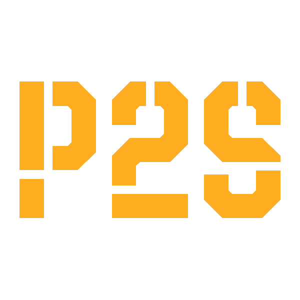
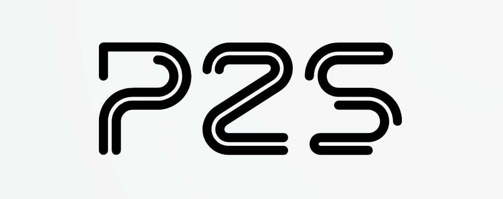
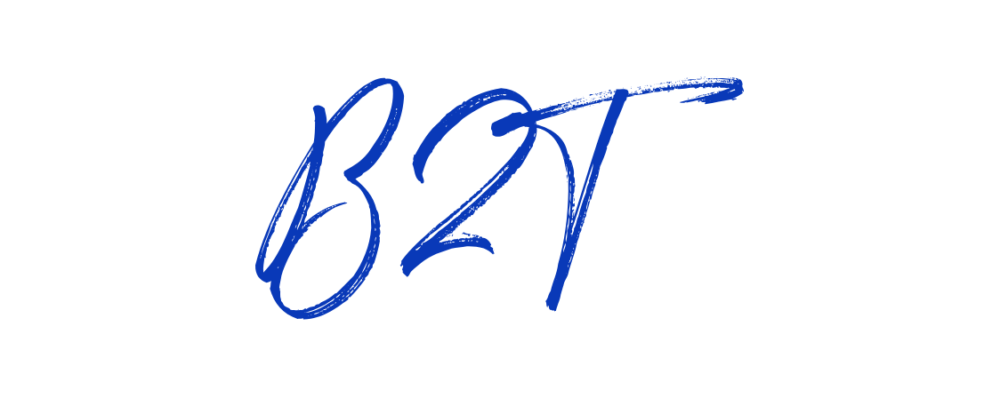

<h1 align="center">P2S - PNG to SVG Converter</h1>

  

<h2>Overview</h2>

P2S is a modern web application that converts raster images (PNG, JPEG) to scalable vector graphics (SVG) format. This tool runs entirely in the browser, ensuring your images are never uploaded to any server - preserving privacy and security.

<h2>Features</h2>
<ul>
  <li><strong>Client-Side Processing:</strong> All conversion happens locally in your browser</li>
  <li><strong>High-Quality Conversion:</strong> Uses the Potrace algorithm for accurate image tracing</li>
  <li><strong>SVG Editing Tools:</strong> Customize fill color, stroke, filters, and detail levels</li>
  <li><strong>Multi-language Support:</strong> Available in English, French, Arabic, and Spanish</li>
  <li><strong>Responsive Design:</strong> Works on mobile and desktop devices</li>
  <li><strong>Dark/Light Mode:</strong> Toggle between light and dark themes</li>
  <li><strong>Privacy-Focused:</strong> No image data is uploaded or stored</li>
</ul>

<h2>How It Works</h2>

P2S uses modern web technologies to process images directly in your browser:

<ol>
  <li>Upload an image by dragging and dropping or clicking the upload area</li>
  <li>The image is processed using the Potrace library for vectorization</li>
  <li>Edit the resulting SVG with our built-in tools</li>
  <li>Download the optimized SVG file</li>
</ol>

<h2>Tech Stack</h2>
<ul>
  <li><a href="https://reactjs.org/">React</a> (v19) - UI library</li>
  <li><a href="https://github.com/tooolbox/node-potrace">Potrace</a> - Image tracing library</li>
  <li><a href="https://reactrouter.com/">React Router</a> (v7) - Navigation</li>
  <li><a href="https://www.i18next.com/">i18next</a> - Internationalization</li>
  <li><a href="https://sharp.pixelplumbing.com/">Sharp</a> - Image processing</li>
  <li><a href="https://www.npmjs.com/package/browser-image-compression">Browser Image Compression</a> - Client-side optimization</li>
</ul>

<h2>Demo</h2>

Check out our showcase examples:

<table>
  <tr>
    <th>Original Image</th>
    <th>Converted SVG</th>
  </tr>
  <tr>
    <td></td>
    <td></td>
  </tr>
  <tr>
    <td></td>
    <td></td>
  </tr>
</table>

<h2>Getting Started</h2>

<h3>Prerequisites</h3>
<ul>
  <li>Node.js (v16 or higher)</li>
  <li>npm or yarn</li>
</ul>

<h3>Installation</h3>
<ol>
  <li>
    
Clone the repository:

    <pre><code>git clone https://github.com/y1hy11/P2S---Pic-To-Svg-Converter </code></pre>
  </li>
  <li>
    
Install dependencies:

    <pre><code>npm install</code></pre>
  </li>
  <li>
    
Start the development server:

    <pre><code>npm start</code></pre>
  </li>
  <li>
    
Open <a href="http://localhost:3000">http://localhost:3000</a> to view in your browser.

  </li>
</ol>

<h2>Key Features Explained</h2>

<h3>Image Conversion Process</h3>

The core functionality of P2S is handled by the <code>convertImageToSvg</code> function, which:

<ul>
  <li>Loads images into a canvas element</li>
  <li>Analyzes brightness to adjust threshold settings</li>
  <li>Converts to grayscale for better tracing</li>
  <li>Uses Potrace to generate SVG paths</li>
  <li>Optimizes the resulting SVG code</li>
</ul>

<h3>SVG Editing</h3>

After conversion, users can customize their SVG with the following options:

<ul>
  <li>Fill color selection</li>
  <li>Stroke color and width</li>
  <li>Filter effects (internal, edge)</li>
  <li>Detail level adjustment</li>
  <li>Blur settings</li>
</ul>

<h3>Internationalization</h3>

P2S supports multiple languages:

<ul>
  <li>English (default)</li>
  <li>French</li>
  <li>Arabic (with RTL support)</li>
  <li>Spanish</li>
</ul>

Language detection is automatic, with manual override available in the navbar.

<h2>Contributing</h2>

Contributions are welcome! To contribute:

<ol>
  <li>Fork the repository</li>
  <li>Create a new branch (<code>git checkout -b feature/amazing-feature</code>)</li>
  <li>Make your changes</li>
  <li>Commit your changes (<code>git commit -m 'Add some amazing feature'</code>)</li>
  <li>Push to the branch (<code>git push origin feature/amazing-feature</code>)</li>
  <li>Open a Pull Request</li>
</ol>

<h2>License</h2>

This project is licensed under the MIT License.

<h2>Contact</h2>
<ul>
  <li>GitHub: <a href="https://github.com/Y1hy11">My GitHub Profile</a></li>
  <li>Twitter: <a href="https://x.com/y1hy1_1">@y1hy1_1</a></li>
  <li>LinkedIn: <a href="https://www.linkedin.com/in/yahya-elalaoui/">Yahya Elalaoui</a></li>
</ul>

Made with ❤️ by Y1hy11
